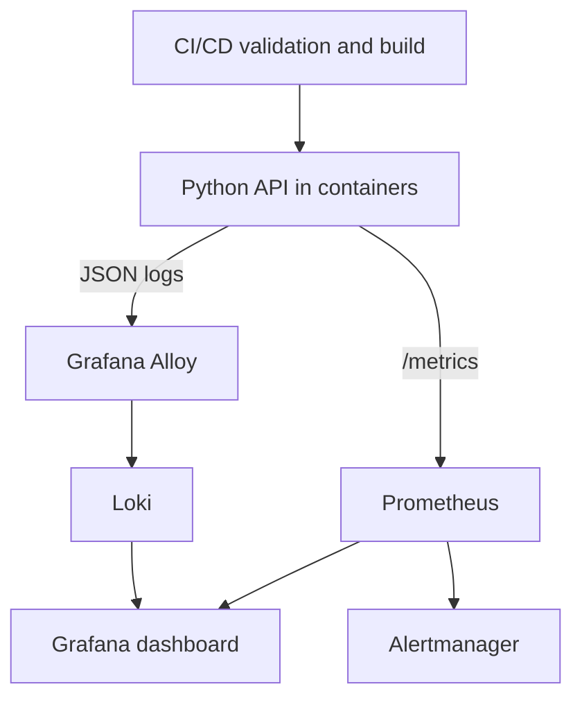

# Multi-cloud DevOps Observability Lab

**Infrastructure as Code · Containers · Kubernetes · CI/CD · Metrics · Logs · Alerts**

A reproducible Cloud Engineering project combining independent AWS, Microsoft Azure and Oracle Cloud Infrastructure foundations with a containerized Python service and an integrated observability stack. It demonstrates how infrastructure definitions, application delivery, configuration management and operational signals fit into one version-controlled system.

**Author:** Michelle Ferraz

## System design

The workload runs locally through Docker Compose or a kind Kubernetes cluster. Azure and OCI network foundations use Terraform; AWS networking and CloudWatch resources use CloudFormation. Each cloud foundation has its own lifecycle and address space. The repository does not create a cross-cloud VPN or deploy managed Kubernetes services.



## Components

| Area | Implementation |
|---|---|
| Application | Flask API, Gunicorn, health/readiness probes, controlled failures |
| Instrumentation | Request counter, latency histogram, active-request gauge, process metrics |
| Containers | Non-root image, read-only API filesystem, bounded resources, Compose |
| Kubernetes | Two API replicas, rolling updates, probes, ConfigMap, Secret, optional HPA |
| Azure | Resource Group, VNet, subnet, NSG and subnet association through Terraform |
| OCI | VCN, private subnet, route table and custom security list through Terraform |
| AWS | VPC, subnet, security group, log group, metric filter, alarm and dashboard |
| Configuration | Idempotent Ansible playbook for application environment and metadata |
| Metrics | Prometheus scrape configuration, PromQL and alert rule tests |
| Logs | Structured JSON logs, Alloy collection and Loki ingestion |
| Visualization | Provisioned Grafana data sources and seven dashboard panels |
| Delivery | GitHub Actions, GitLab CI/CD and Azure Pipelines |
| Image release | Manually triggered GitHub Container Registry publication |
| Operations | Smoke tests, bounded traffic generator, incident runbooks, cleanup procedures |

## Run with Docker Compose

Prerequisites: Docker Engine with Compose v2.24.4+ or Docker Desktop using Linux containers, Python 3.12, and available local ports 8080, 3000, 9090 and 9093. Allocate approximately 4 GB of RAM to Docker for the complete stack. Downloads require internet access. On Windows, use WSL2 for Bash, Ansible and Terraform commands.

From the project root:

```bash
python scripts/prepare_env.py
docker compose up -d --build
python scripts/smoke.py
python scripts/traffic.py --mode normal --seconds 60
```

| Interface | Address |
|---|---|
| API | http://localhost:8080 |
| Metrics | http://localhost:8080/metrics |
| Grafana | http://localhost:3000 |
| Prometheus | http://localhost:9090 |
| Alertmanager | http://localhost:9093 |

Grafana user: `admin`. The generated password is in your local `.env`. Open **Dashboards → Multi-cloud Lab → Multi-cloud DevOps Observability Lab**. Give rate-based panels at least two scrapes and sustained traffic. Loki is accessed through Grafana on the internal container network.

The smoke test checks a live request, metric collection and structured log delivery. An empty dashboard before traffic is expected; it is not populated with fabricated sample results.

```bash
docker compose down
# Remove retained local telemetry only when you want a clean reset:
docker compose down -v
```

## Run with Kubernetes

Install kind, kubectl, Docker and Bash. Stop Compose first if you will use the same forwarded ports.

```bash
bash scripts/kind_deploy.sh
bash scripts/kind_smoke.sh
kubectl --context kind-multicloud-lab -n multicloud-lab port-forward svc/grafana 3000:3000
```

The deployment script explicitly targets `kind-multicloud-lab`. It builds and loads the API image, creates the namespace and Grafana Secret, applies shared configuration using Kustomize and waits for rollouts. Prometheus discovers individual API Pods; each Pod has an Alloy sidecar. For further ports, scaling and rollback, see [Kubernetes operations](docs/kubernetes.md).

## Infrastructure lifecycle

Cloud commands require your own authenticated accounts. `plan` previews changes; `apply` creates resources. Review account, region and the complete plan before applying.

```bash
terraform -chdir=terraform/azure init -backend=false
terraform -chdir=terraform/azure validate
terraform -chdir=terraform/oci init -backend=false
terraform -chdir=terraform/oci validate
```

Follow [cloud deployment](docs/cloud-deployment.md) for authentication, configuration, plans, CloudFormation, log shipping and teardown. The foundations contain network resources and AWS telemetry resources; compute, load balancers and managed Kubernetes clusters are outside this deployment definition.

## Test and validate

```bash
python -m venv .venv
source .venv/bin/activate
python -m pip install -r requirements-dev.txt
python -m unittest discover -s tests -v
python scripts/check_config.py
cfn-lint cloudformation/aws/template.yaml
terraform fmt -check -recursive terraform
ansible-playbook -i ansible/inventory.ini ansible/playbook.yml
ansible-playbook -i ansible/inventory.ini ansible/playbook.yml
bash scripts/validate_containers.sh
```

The second unchanged Ansible run should report `changed=0`. CI adds Compose and Kubernetes integration checks. See [validation record](docs/validation.md) for the checks actually executed for this package and the commands used to reproduce them.

## Documentation

| Document | Contents |
|---|---|
| [Comece aqui](COMECE_AQUI.md) | Guia operacional em português |
| [Architecture](docs/architecture.md) | Components, boundaries, data flow and lifecycle |
| [Cloud deployment](docs/cloud-deployment.md) | Azure, OCI, AWS, state and cleanup |
| [Kubernetes](docs/kubernetes.md) | Deployment, discovery, HPA and rollback |
| [Observability](docs/observability.md) | Metrics, LogQL, PromQL, alert evaluation |
| [Runbooks](docs/runbooks.md) | Controlled incidents, investigation and recovery |
| [CI/CD](docs/ci-cd.md) | Pipeline behavior and image publication |
| [Decisions](docs/decisions.md) | Architecture decision records |
| [Security and operations](docs/security-operations.md) | Identity, secrets, storage and operational controls |
| [Cloud comparison](docs/cloud-comparison.md) | AWS × Azure × OCI mapping |
| [References](docs/references.md) | Official technical sources |

## Repository description

Hands-on Cloud Engineering project with Azure and OCI Terraform foundations, AWS CloudFormation, Docker, Kubernetes, Ansible, CI/CD, Prometheus, Grafana, Alloy, Loki and CloudWatch.

Suggested GitHub topics: `cloud-engineering`, `multi-cloud`, `terraform`, `azure`, `oci`, `aws`, `kubernetes`, `docker`, `ansible`, `observability`, `prometheus`, `grafana`, `loki`, `cicd`.

Licensed under [MIT](LICENSE). Third-party products retain their own licenses.
