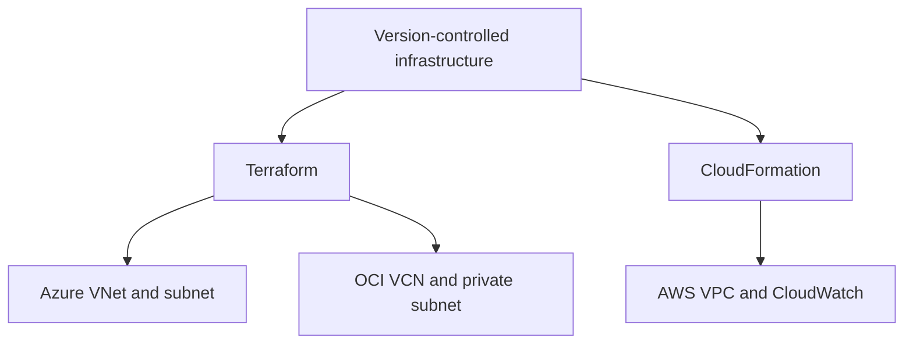

# Architecture

## Boundaries

There are two independent deployment layers:

1. **Infrastructure foundations:** non-overlapping private network definitions for AWS (`10.10.0.0/16`), Azure (`10.20.0.0/16`) and OCI (`10.30.0.0/16`). AWS also hosts the optional CloudWatch log-to-metric pipeline.
2. **Portable workload:** the same Python image and observability configuration run in Compose or local Kubernetes. These are executable deployment targets; the cloud network definitions do not themselves schedule containers.

## Request and telemetry flow

The service accepts HTTP requests and produces a response, a bounded set of Prometheus metric labels and one JSON log event. It creates a server-side request ID and returns it in `X-Request-ID`. Health checks and metric scrapes are excluded from business traffic metrics.

Prometheus scrapes the API at 15-second intervals. Rules evaluate every 15 seconds and send firing alerts to Alertmanager. Grafana queries Prometheus and Loki; it does not store the application metrics itself. Alloy tails the application's rotating log file and sends entries to Loki.

In Kubernetes, each API Pod owns its log volume and an Alloy sidecar. Discovery uses a namespace-scoped Role granting only get/list/watch for Pods. Prometheus filters the API label and the named application port, so the Alloy sidecar is not accidentally scraped as the API.

## Runtime and storage

| Component | Compose | Kubernetes |
|---|---|---|
| API | One non-root container, four threads | Two replicas, one process/four threads per Pod |
| Logs before ingestion | Shared named volume, rotating JSONL | Per-Pod emptyDir, rotating JSONL |
| Alloy positions | Named volume | Per-Pod emptyDir |
| Prometheus | Named volume, 24-hour retention | emptyDir, 24-hour retention |
| Loki | Named volume, 24-hour retention | emptyDir, 24-hour retention |
| Grafana | Named volume; dashboard provisioned from JSON | emptyDir; dashboard and data sources provisioned |
| Alertmanager | Named volume | emptyDir |

Kubernetes telemetry storage is ephemeral by design. Deleting a Pod can discard that component's local history; provisioned dashboards return from version control. Durable deployments require an explicit storage class, PVC sizing, backups and corresponding retention decisions.

## Lifecycle separation

Terraform state is independent for Azure and OCI. CloudFormation manages the AWS stack. Ansible renders configuration files but does not create cloud resources. CI validates and runs ephemeral integration environments; cloud account creation and cloud applies are not part of CI.

## Availability semantics

Readiness controls whether traffic should be routed to the API. Liveness detects a process that stops answering. Rolling updates preserve API availability within the configured replica budget. In this stateless sample, neither endpoint checks an external database because there is no database dependency.

The metrics registry is process-local. One Gunicorn worker per container avoids incomplete multi-process metrics; Kubernetes handles horizontal replication. Increasing Gunicorn workers requires a deliberate switch to Prometheus multiprocess mode.
